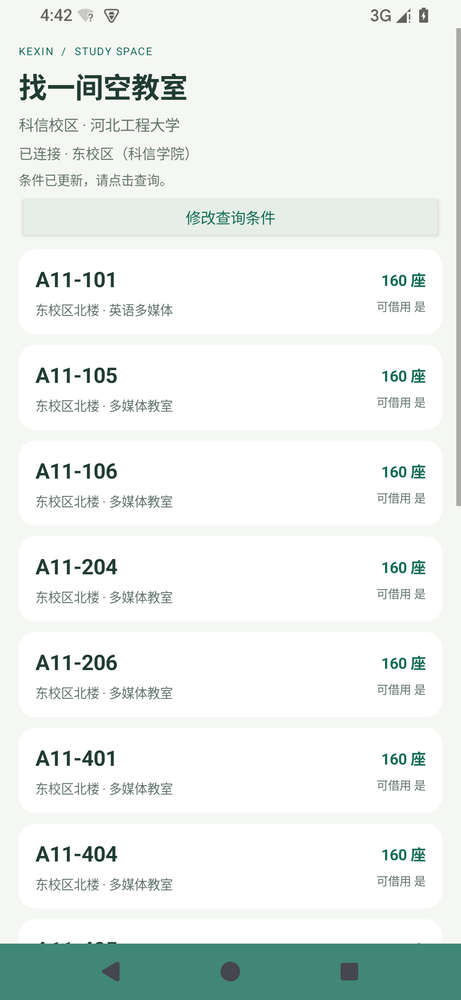

# 科信空教室

河北工程大学科信校区的原生 Android 空教室查询应用。Java + Android 原生控件，HTTPS 直连学校，无 WebView、网页套壳或中转服务。支持 Android 8.0 及以上。

## 下载

在项目右侧打开 **Releases**，下载最新版本中的 `科信空教室-1.0.0.apk`。首次安装时，Android 可能提示允许安装来自当前浏览器或文件管理器的应用。



## 使用

首次安装后，在手机上输入自己的教务账号密码。成功登录才将账号密码用 Android Keystore + AES-GCM 加密保存在该手机；下次启动自动登录。安装包不预置任何学生账号、密码、Cookie 或浏览器会话。账号与隐私菜单可退出并清除本机数据。

校区固定为学校的“东校区(科信学院)”（106），不能切换至其他校区。选择日期、起止节次、教学楼和场地类别后查询。默认今天、第 1—2 节、多媒体教室；这些条件会明确显示，可自行调整。学校的“全部场地类别”也可能包括操场等非教室场地，建议保留多媒体教室或选择所需教室类型。

每次搜索重新请求学校当前学年、学期、校历、科信节次和教学楼配置；不使用打包时的年份，不选择下拉列表里预设的最远未来学年。默认“今天”按北京时间在搜索和返回前台时更新；手动选定的日期则保持，且必须位于学校当前学期允许的周次。当前学期无可查日期、学校校历结构变更或网络失败时明确报错，不回退到上一年。

结果包含日期、节次和本次查询完成时间。没有本地结果缓存，不离线伪造结果。前台再次搜索、重新启动或返回查询界面时重新获取数据。页面上的结果是查询时刻的快照，不是持续推送的现场监控。系统空闲只代表教务排课和占用记录，并不保证现场没有临时使用者。

学校要求验证码时，需手动填写原生对话框中的验证码；不承诺绕过学校验证。密码不正确时停止自动重试。系统维护、网络限制或学校改版也可能使查询暂不可用。

## 实现边界

- 仅登录、读取当前校历和查询空闲场地，不含选课、预约、成绩查询或账号修改功能。
- 网络层限定学校 HTTPS 域名及必要路径，保留系统证书校验。
- 返回结果逐条核对校区 106 和科信名称；不匹配即拒绝显示。
- 完整读取分页，重复分页、数量不一致或返回格式异常均报错，不把部分数据称作完整结果。
- 账号加密信息不参与 Android 云备份和设备迁移；密码、Cookie 不写入日志。

## 构建

使用 JDK 17 或 21、Android SDK 35、Build Tools 35.0.0、Gradle 8.11.1、Android Gradle Plugin 8.9.2。依赖 jsoup 1.18.3 只负责解析登录和配置 HTML，界面始终是原生控件。

设置本机 `local.properties` 的 `sdk.dir`，然后执行：

```powershell
.\gradlew.bat assembleDebug testDebugUnitTest lintDebug
.\gradlew.bat assembleRelease
```

release 构建生成未签名 APK，使用自己的签名密钥通过 zipalign / apksigner 签名。交付的 APK 另行签名；该私钥不包含在源码包或 APK 中。修改源码后若使用不同签名安装，需要先卸载原包，原包的本机登录信息会随卸载清除。

## 验证

验证细节见交付目录的 `验证说明.md`。单元测试目录内有去除个人信息的真实学校响应样本，仅用于测试，不打入应用 APK，也不作为应用结果数据源。

真实账号密码登录、验证码触发和手机网络条件需要在用户手机上最终验收。本次开发使用用户已登录浏览器的会话验证了原生查询，未获取用户密码。

## 参考

- [学校教务登录页](https://jwglxxfwpt.hebeu.edu.cn/xtgl/login_slogin.html)
- [Android Keystore](https://developer.android.com/privacy-and-security/keystore)
- [AGP 8.9 兼容版本说明](https://developer.android.com/build/releases/agp-8-9-0-release-notes)
- [jsoup](https://jsoup.org/)

非学校官方应用。学校接口发生变更后可能需要适配更新。
